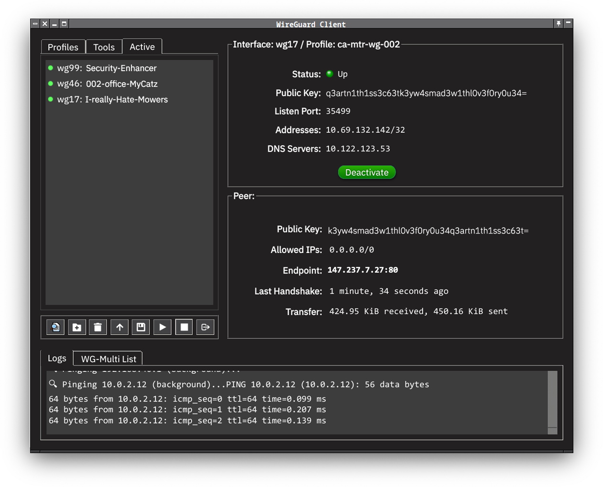
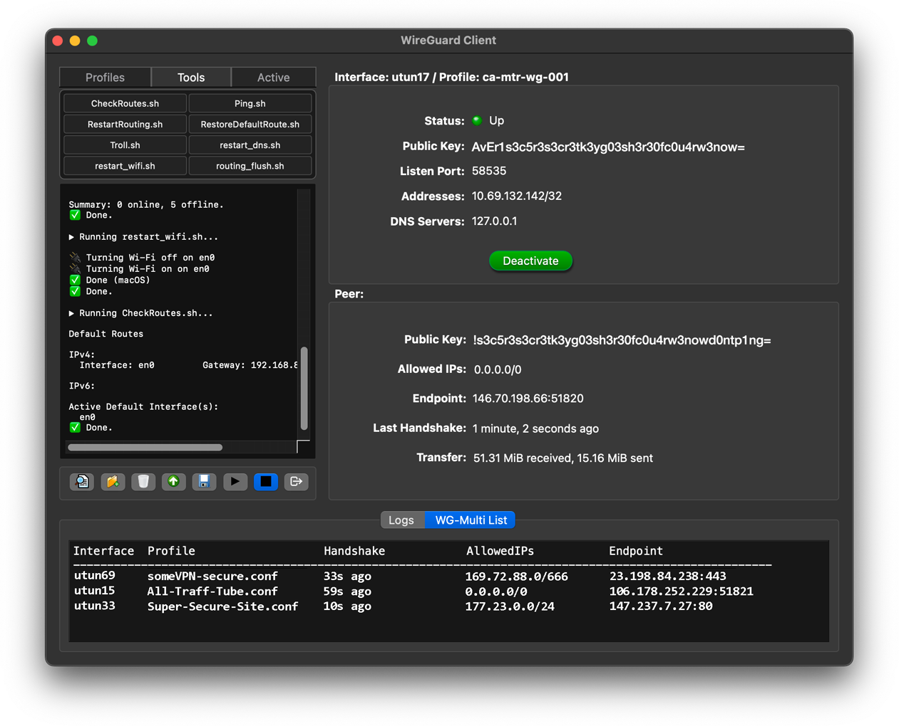

# WireGuard GUI Client for FreeBSD & macOS





A PyQt6-based graphical interface for managing multiple WireGuard VPN profiles. This application enables secure, user-friendly management of tunnels, routes, and connection details, with integrated configuration editing and robust workflow safety. This is a work in progress building of a tool I wanted for myself. It is working for me and if it works for you great. 

---

## Features

- **Multi-profile support**: List, add, edit, activate, and remove WireGuard profiles.
- **Profile list with quick actions**:
  - **Double-click** a profile to connect or disconnect.
  - **Context menu** for editing, deleting, and exporting configurations.
- **Double-click to connect/disconnect** from any profile directly in the list.
- **Confirmation dialog before deleting profiles** (prevents accidental removal).
- **Multi-tunnel support**: Simultaneously manage and track multiple tunnels using deterministic interface assignment (`wgN`, `utunN`).
- **Route and DNS management**: Full support for custom per-profile static routes and DNS, applied using helper scripts and restored on disconnect.
- **Automatic full-tunnel conflict resolution**: Ensures only one full-tunnel profile is active at a time by auto-tearing down others if needed.
- **Routes & Tunnel Management**:
  - Assigns deterministic interfaces (`wgN` on FreeBSD, `utunN` on macOS).
  - Automatically tears down any existing full-tunnel before bringing up a new one.
  - Manages custom static routes as defined in configuration or via scripts.
  - Runs per-profile *PostUp* and *PostDown* scripts (see [all_traffic hooks](#all_traffic-hooks) below).
- **Connection status**: Live tray icon shows active/disconnected state. Window can be toggled via the tray.
- **Log Viewer**: Real-time log output with selectable/copyable text.
- **Integrated Editor**:
  - Syntax highlighting for `.conf` files.
  - **Delete confirmation** before removing any profile.
  - Shows public key preview when editing.
- **Safe file operations**: Permission checks for profile changes. Uses `doas` or `sudo` as required.
- **Dark Mode compatible**: Consistent visual appearance for both light and dark environments.
- **Cross-platform**: Works on FreeBSD (with wireguard-kmod or wireguard-go) and macOS.
- **Auto-refresh**: Interface and peer status refresh automatically.
- **System tray & window management**: Clean close/restore with persistent tray icon.

- **Active tab**: See all currently active and connected tunnels, including their details (interface, endpoints, routes, etc.), in real time.
- **Tools tab**: Run and view the output of custom admin/diagnostic scripts from the app. Scripts are loaded from your tools directory and are shown as clickable buttons.


---

## Recent Changes

- Added confirmation dialog before deleting profiles (prevents accidental removal).
- Regenerated UI for native look on both platforms.
- Improved double-click to connect/disconnect.
- All profile operations moved to `/usr/local/etc/wireguard/profiles/` (both FreeBSD and macOS).
- Unified script and profile paths for both macOS and FreeBSD (`/usr/local/etc/wireguard/...`).
- Per-profile routes and DNS handling now use helper scripts for full-tunnel safety.
- Deterministic interface naming (`wgN`, `utunN`) for simultaneous multi-tunnel use.
- Uses `wg-multi-freebsd.sh` or `wg-multi-macos.sh` automatically depending on OS.
- Permission errors handled with clear alerts.
- Added delete confirmation to editor before removing profiles.
- Improved robustness in interface and route management logic.
- UI/UX refinements for easier navigation and log viewing.

---

## Known Regressions & Issues

- **No built-in import from older config folder locations**; manual move may be required.
- **Linux support** is currently untested.
- On macOS, some advanced route management may require administrator privileges at runtime.
- Rapid connect/disconnect can occasionally leave orphaned interfaces (resolved by reboot or manual cleanup).
- Profile editor does not currently validate all config fields before save.

---

## all_traffic Hooks

Custom per-profile `PostUp` and `PostDown` scripts can be set (see your `.conf`), commonly pointing to `all_traffic_post_up.sh` and `all_traffic_post_down.sh`.

These scripts are typically used to:
- Set DNS safely and restore it on disconnect.
- Add or clean up additional static routes not handled by WireGuard directly.
- Perform any needed network setup required for full-tunnel or split-tunnel operation.

**Example:**
```ini
[Interface]
PostUp = /usr/local/etc/wireguard/scripts/all_traffic_post_up.sh
PostDown = /usr/local/etc/wireguard/scripts/all_traffic_post_down.sh
```

---

## Requirements

### 🐍 Python

- Python 3.9+ (tested with 3.11)
- PyQt6

Create a virtual environment (recommended):

```bash
python3 -m venv venv
source venv/bin/activate
pip install PyQt6
```
Or directly:
```bash
pip install PyQt6
```

### 🖥 System Packages

#### FreeBSD:
```bash
sudo pkg install wireguard py311-pyqt6 doas
```

#### macOS:
```bash
brew install wireguard-tools
pip install PyQt6
```

---

## Installation

1. Install dependencies: `pip install PyQt6`
2. Make sure WireGuard is installed and configured on your system.
3. Place profiles in the appropriate directory:
   - **FreeBSD:** `/usr/local/etc/wireguard/profiles/`
   - **macOS:** `/usr/local/etc/wireguard/profiles/`
4. Launch the app:  
```bash
python3 ./wg_gui.py
```

---


## Usage

- **Connect:** Select a profile and click *Connect*, or double-click the profile.
- **Disconnect:** Click *Disconnect* (active tunnel only), or double-click again.
- **Edit profile:** Right-click > Edit, or use the Edit button.
- **Delete profile:** Right-click > Delete (confirmation required).
- **View logs:** Use the *Logs* tab for real-time connection output.
- **Tray menu:** Right-click the tray icon for quick access and quit.

## Tools Directory

- Place any executable shell scripts you wish to appear in the Tools tab into the tools/ directory (in the same folder as wg_gui.py).
- Scripts will appear as buttons in the Tools tab. Click a button to run the script and view its output within the app.
- Scripts must be executable (e.g., run chmod +x tools/myscript.sh).
- Script output is displayed with preserved formatting for easier review.
- Use this for quick admin tasks (e.g., ping, status scripts, speed tests, etc.) without leaving the GUI.

⸻


---

## Tray Icon Behavior

- The app minimizes to the **system tray**, not the taskbar.
- The tray icon automatically adjusts for **light or dark mode**, using the appropriate SVGs:
  -  **Show**
  -  **Disconnect**
  -  **Disconnect & Quit**
- The tray icon changes color/state when the connection is active.
- **Left-click** toggles visibility of the main window.
- **Right-click** shows the context menu with the options above.

---

## Why This Exists

This project was created to:
- Simplify switching between multiple WireGuard configs
- Provide a visual interface for monitoring connection details
- Fill the gap for missing FreeBSD GUIs or terminal-only tools
- Built with PyQt6 for easy tweaking (stylesheets, icons, layout) and portability
- AI tools helped me, otherwise this would be next to impossible
- I built this for myself and I think it can be useful to someone maybe

---

## Customization

- **Icons:**  
  Replace `wireguard_off.png`, `wg_connected.png`, and `wireguard.png` with your own, or use theme-aware SVGs for tray menu entries (`Icons/eye_dark.svg`, `Icons/plug-off_dark.svg`, `Icons/logout_dark.svg` for dark mode).
- **Stylesheet:**  
  Modify `APP_STYLESHEET` in `wg_gui.py` for colors, fonts, padding, and behavior.
- **Tray Behavior:**  
  Toggle visibility, show/hide messages, or even auto-connect on startup.

---

## License

MIT License
---

## 📦 Version 0.2.1 – Changelog

Released: (2025-06-22)

### Core Improvements
- Introduced `priv.py`: a cross-platform privilege escalation handler supporting `sudo`, `doas`, and native AppleScript elevation.
- Refactored `wg-multi-freebsd.sh` and `wg-multi-macos.sh` for unified privilege handling, safer route restoration, and improved `%i` expansion in `PostUp` hooks.
- More reliable parsing of `AllowedIPs`, `Endpoint`, and route behavior.
- Interface cleanup logic improved for `utun` handling on macOS.
- Added detection of orphaned interfaces and auto-cleanup.
- Added more robust default route restoration logic and DNS backup/restore.

### 🧰 New Utilities

| Tool              | Description |
|-------------------|-------------|
| `Ping.sh`         | Pings common infrastructure sites and performs DNS resolution tests using OS-specific `dig`. |
| `restart_dns.sh`  | Resets macOS system DNS resolver using `dscacheutil`, `mDNSResponder`, and optionally overrides `/etc/resolv.conf`. |
| `restart_wifi.sh` | Simple macOS script to power-cycle the Wi-Fi interface using `networksetup`. |
| `routing_flush.sh`| Cross-platform script to delete default routes and reacquire DHCP or reset routing state. |
| `CheckRoutes.sh`  | Audits current routing table to ensure that required tunnels (especially 0.0.0.0/0) are active and prioritized. |
| `Troll.sh`        | A humorous script that simulates terminal output — use it for stress testing or fun. |

### Development Enhancements
- All helper scripts now resolve platform-specific tool paths.
- All tools prefer `doas` but fallback gracefully to `sudo`.
- GUI password prompts on macOS supported via `ssh-askpass` or `ssh-askpass-gui`, if installed and configured.
- `get_ssid.py` (in `tools/MacOS/`) provides a programmable way to detect connected Wi-Fi SSID via `CoreWLAN`.

---
