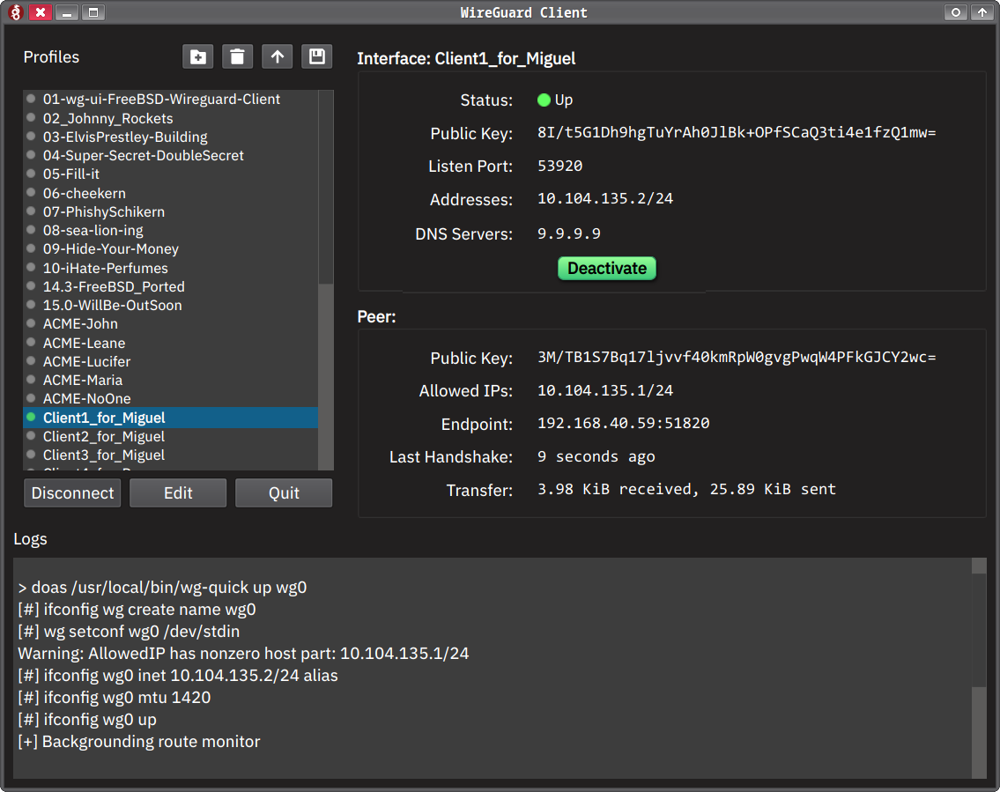

# WireGuard GUI Client for FreeBSD [& MacOS]


This is a PyQt6-based graphical interface for managing WireGuard VPN profiles. It allows you to easily view connection details, switch between profiles, connect/disconnect from the VPN, and see live logs.

---

## Features

* System tray icon with connection status (disconnected / connected)
* Toggle visibility by clicking the tray icon
* Tray icon persists even when the window is closed
* ~~Clean, responsive interface using Qt Stylesheets (QSS)~~
* Auto-refreshing interface and peer status
* Selectable text in all details and logs
* Compact, monospaced layout for easy reading
* Profile list with custom styling and indicator icons
* Logs with live ping output for connectivity tests (if configured)
* Built-in editor with syntax highlighting for `.conf` files
* Public key preview when editing or creating a profile
* Profiles are hot-switched — interface is brought down before activating a new one
* Does not disconnect on window close — connection stays active until manually stopped
* Single-instance locked Prevents multiple copies of the app from running simultaneously.
* Theme-aware tray icons (light/dark mode) [still missing light styles.]
* Dark mode detection


## Filesystem Layout

### The application expects:

* WireGuard profile configs in: `~/scripts/wireguard_client/profiles/*.conf`
* Runtime config copy to: `/usr/local/etc/wireguard/wg0.conf`
* Interface name is `wg0` on FreeBSD/Linux and `utun4` on macOS

### Icons:
* wireguard_off.png and wg_connected.png used for tray state
* Place them inside an Icons/ folder next to wg_gui.py
### App icon:
* wireguard.png is used as the main window icon

## Requirements

### 🐍 Python

* Python 3.9+ (tested with 3.11)
* PyQt6

Install with:

```bash
python3 -m venv venv
source venv/bin/activate
pip install PyQt6
```

Or directly:

```bash
pip install PyQt6
```

### System Dependencies

On **FreeBSD**:

```bash
sudo pkg install wireguard py39-pyqt6 doas
```

Adjust `py39-` for your version of Python.

On **Linux** (Debian/Ubuntu):

```bash
sudo apt install wireguard python3-pyqt6 doas
```

> `doas` can be replaced by `sudo` if preferred — adjust the script accordingly.

On **macOS**:

```bash
brew install wireguard-tools pyqt6
```

This application **uses a wrapper script by default** on macOS — specifically `wg-quick-bash.sh` — because Homebrew’s `wg-quick` fails to run unless the correct `bash` binary is found. This is due to `/opt/homebrew/bin/bash` not being in the default path for shebang resolution. The wrapper guarantees compatibility with `wireguard-go`, handles stale `utunX` interface cleanup, and ensures routing setup and teardown behave consistently. The GUI calls this wrapper automatically.

A sample wrapper is provided in the repository.

On **macOS** (with Homebrew):
```bash
brew install wireguard-tools pyqt6
```
Ensure `doas` is available, or modify the script to use `sudo`.

## Running the GUI

```bash
./wg_gui.py
```

Or make it executable:

```bash
chmod +x wg_gui.py
./wg_gui.py
```
On macOS, make sure the script has access to launch `doas`/`wg-quick` in the system path. You may need to adjust permissions or codesign it.

## Switching Profiles

* When you select a new profile, the interface is safely shut down and restarted with the new config.
* If the interface is already up, it will be cleanly stopped before switching.
* The app supports #ping <host> directives in the profile for automatic post-connect testing.
    ```
    #ping 10.0.1.1
    ```
    to test post-connection reachability, with the ping output visible in the log area.
If the interface fails to start, the app will attempt to retry and re-run `wg-quick up` with fallback logic.

## Example Profile File

```ini
[Interface]
# The app will display the derived public key when editing this profile
PrivateKey = <your-private-key>
Address = 10.0.0.2/32
DNS = 1.1.1.1

[Peer]
PublicKey = <server-public-key>
AllowedIPs = 0.0.0.0/0
Endpoint = your.server.com:51820
PersistentKeepalive = 25
#ping 10.0.0.1
```  
## Tray Icon Behavior

* The app minimizes to the **system tray**, not the taskbar.
* The tray icon automatically adjusts for **light or dark mode**, using the appropriate SVGs:

   **Show**  
   **Disconnect**  
   **Disconnect & Quit**

* The tray icon changes color/state when the connection is active.
* **Left-click** toggles visibility of the main window.
* **Right-click** shows the context menu with the options above.

## Why This Exists

### This project was created to:

* Simplify switching between multiple WireGuard configs
* Provide a visual interface for monitoring connection details
* Fill the gap for non existing other GUIs or terminal-only tools
* Built with PyQt6 for easy tweaking (stylesheets, icons, layout) and portability

## Customization

* **Icons:**
Replace wireguard_off.png, wg_connected.png, and wireguard.png with your own  
You can also use theme-aware SVGs for tray menu entries. Files like `eye_dark.svg`, `plug-off_dark.svg`, and `logout_dark.svg` are used for dark mode.

* **Stylesheet:**
Modify APP_STYLESHEET in wg_gui.py for colors, fonts, padding, and behavior

* **Tray Behavior:**
Toggle visibility, show/hide messages, or even auto-connect on startup

## Automatic Route Handling

To ensure clean connection and disconnection behavior across all WireGuard profiles, the app integrates two global lifecycle scripts:

### `global_postup.sh`
This script is automatically run **after a profile is connected**, and performs:

- Logging the active interface and timestamp
- Displaying active routes for the tunnel interface (e.g. `wg0`)
- Starting a background route monitor to passively observe routing changes

Sample output (visible in GUI log):

```
[global_postup] ✅ WireGuard up: wg0
[global_postup] Routing table entries:
10.7.0.0/24     10.7.0.2     UGS     wg0
[global_postup] Starting route monitor for wg0/utun4...
[global_postup] Done.
```

### `flush_wg_routes.sh`
This script runs **automatically on disconnect** and:

- Identifies and removes any active routes associated with `wg0`
- Ensures the system routing table is clean after tunnel teardown

If no tunnel-specific routes are present, it exits safely:

```
[flush_wg_routes] No routes found for interface wg0/utun4
```

These scripts:

- Ensure **no stale routes or leaks** are left behind
- Improve security, reliability, and debug clarity
- Run silently unless action is needed
- Require no user configuration or toggling — they're always safe to use

## Platform Notes

- On **macOS**, the interface used is `utun4` and `wg-quick` is expected to be in `/opt/homebrew/bin`.
- On **FreeBSD**, the app uses `wg0` and assumes you have `doas` installed via pkg.
- `doas` is used throughout for elevated commands. You can patch the script to use `sudo` if needed.
- The system tray icons auto-adjust for dark/light themes using separate SVGs.

# WireGuard Client GUI – Change Log

This document outlines all key differences and enhancements between the **old** and **new** versions of the WireGuard Client Qt application.

## Structural and Logic Changes

### Platform-Aware Binary Handling
- Added detection of platform (macOS vs FreeBSD/Linux).
- Dynamically selects `bash` and `wg-quick` binaries using `shutil.which()` or platform-specific paths.
- Replaces hardcoded `"wg-quick"` with `WG_QUICK` variable.

### Toggle-Based Connection Control
- Replaced Connect/Disconnect buttons with:
  - `btnToggle`: under Interface panel (styled button)
  - `btnProfileToggle`: beside Edit/Quit in the profile list
- Toggle logic unified with `on_toggle_state()` and `on_profile_toggle()`.

### Tray Icon Context Menu Enhancements
- Theme-aware icon selection (light/dark variants).
- Dynamically updated via `update_tray_menu_icons()`.

## Visual and UI Enhancements

### Interface & Peer Form Layouts
- All labels aligned with fixed width (`130px`).
- Increased spacing for legibility (`setHorizontalSpacing(40)`).
- Uniform `label.setMinimumHeight(28)` for rows.

### Fade-In Animation for Profile List
- Applied `QGraphicsOpacityEffect` + `QPropertyAnimation` to fade in profile list.

### Toggle Button Styling
- Added drop shadow via `QGraphicsDropShadowEffect`.
- Custom gradient backgrounds for on/off states.

### Custom App Stylesheet
```css
QLabel.data-label {
    font-family: "Consolas","IBM Plex Mono", "JetBrains Mono", monospace;
    text-shadow: 2px 2px 2px rgba(0, 0, 0, 0);
}
```
## Functional Enhancements

### Profile Management
Added icons and logic for:
- ➕ `Add Profile`
- 🗑 `Delete Profile`
- 📤 `Upload Profile` (.conf)
- 📦 `Download All Profiles` (.zip)

### In-App Profile Editing
- Replaced external editor with:
  - `QPlainTextEdit`
  - `WireGuardHighlighter` (syntax highlighting `[sections]`, `key=value`, and `# comments`)

### Route Cleanup Fix
- Now calls:
```bash
pkill -f "route_monitor.sh start wg0"
```
before activating profiles to avoid stale monitor processes.

## Code Maintenance & Cleanup

- Reused functions for config and status parsing (`parse_wg_conf`, `parse_wg_show`).
- Improved `is_interface_up()` logic to use `wg show` output directly.
- Tray icon and status refresh code refactored for clarity and reliability.

## Behavioral Improvements

- Improved load behavior with `QTimer.singleShot(100, self.refresh_status)`.
- Proper cleanup on disconnect with toggle state reset and route flush.
- System tray shows correct profile and connection info dynamically.

## Deprecated or Removed

- Removed standalone `Connect` / `Disconnect` buttons. [Still trying to figure out the best button layout and design]
- Removed redundant slot connections from main button panel.


## License
[](LICENSE)
