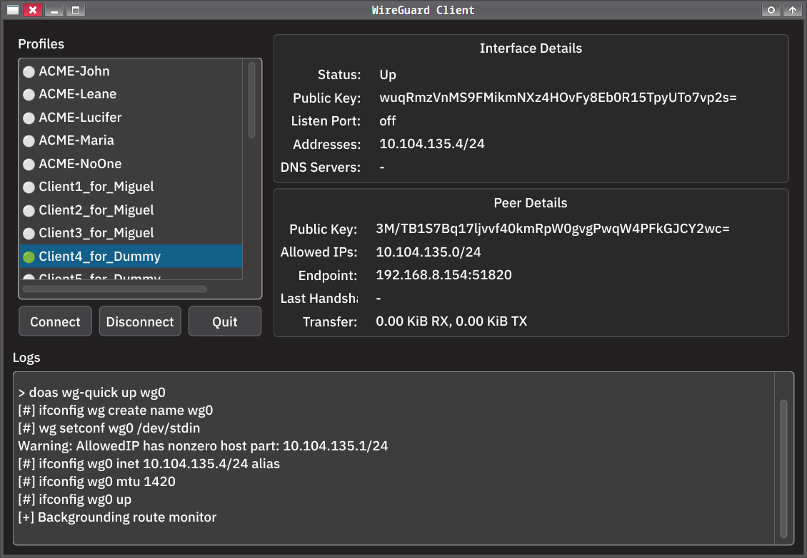

# WireGuard GUI Client for FreeBSD/Linux



This is a PyQt6-based graphical interface for managing WireGuard VPN profiles. It allows you to easily view connection details, switch between profiles, connect/disconnect from the VPN, and see live logs.

---

## Features

* Auto-refreshing connection and peer status
* Easy profile switching
* Logs with `ping` test support
* Responsive PyQt6 interface
* Selectable labels and scrollable info areas

---

## Filesystem Layout

The application expects:

* WireGuard profile configs in: `~/scripts/wireguard_client/profiles/*.conf`
* Runtime config copy to: `/usr/local/etc/wireguard/wg0.conf`
* Interface name is assumed to be `wg0`

---

##  Requirements

### 🐍 Python

* Python 3.9+ (tested with 3.11)
* PyQt6

Install with:

```bash
python3 -m venv venv
source venv/bin/activate
pip install PyQt6
```

Or directly:

```bash
pip install PyQt6
```

###  System Dependencies

On **FreeBSD**:

```bash
sudo pkg install wireguard py39-pyqt6 doas
```

Adjust `py39-` for your version of Python.

On **Linux** (Debian/Ubuntu):

```bash
sudo apt install wireguard python3-pyqt6 doas
```

> `doas` can be replaced by `sudo` if preferred — adjust the script accordingly.

---

## Running the GUI

```bash
./wg_gui.py
```

Or make it executable:

```bash
chmod +x wg_gui.py
./wg_gui.py
```

---

##  Switching Profiles

When switching between profiles, the current connection is automatically disconnected, and the selected one is brought up. If the interface is already active, it is torn down first.

Your WireGuard profile can include an optional line:

```ini
#ping 10.0.1.1
```

to test post-connection reachability.

---

##  Example Profile File

```ini
[Interface]
PrivateKey = <your-private-key>
Address = 10.0.0.2/32
DNS = 1.1.1.1

[Peer]
PublicKey = <server-public-key>
AllowedIPs = 0.0.0.0/0
Endpoint = your.server.com:51820
PersistentKeepalive = 25
#ping 10.0.0.1
```

---

##  Why This Exists

This project was created to:

* Simplify switching between multiple WireGuard configs
* Provide a visual interface for monitoring connection details
* Avoid the complexity of existing bulky GUIs or terminal-only tools

It's built with PyQt6 for ease of use, portability, and extensibility.

---

##  License
Use as you please.
