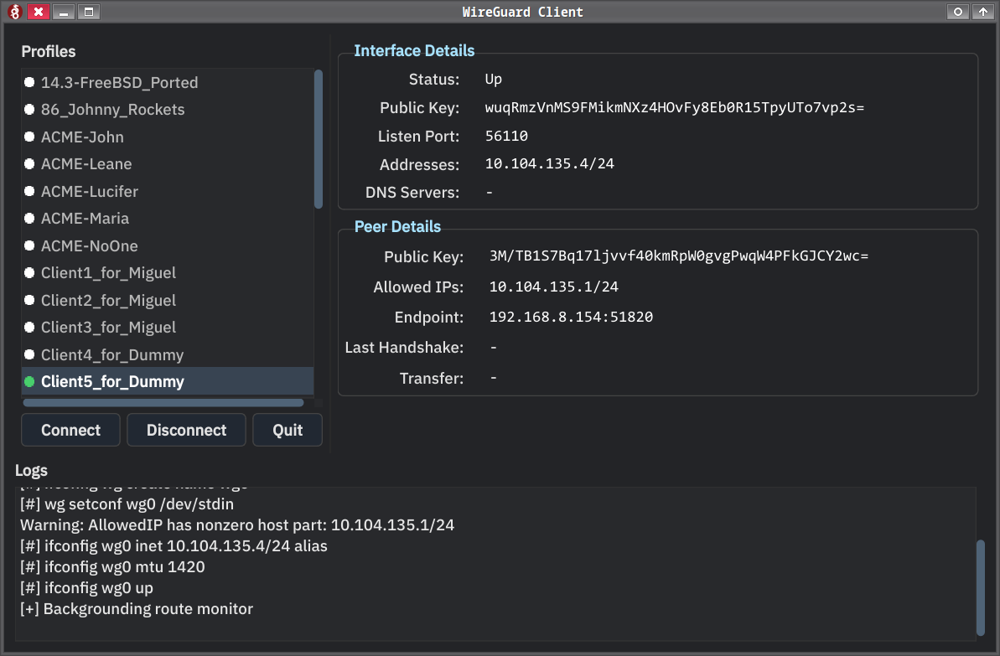

  # WireGuard GUI Client for FreeBSD
  
  
  
  This is a PyQt6-based graphical interface for managing WireGuard VPN profiles. It allows you to easily view connection details, switch between profiles, connect/disconnect from the VPN, and see live logs.
  
  ---
  
  ## Features
  
* System tray icon with connection status (disconnected / connected)
* Toggle visibility by clicking the tray icon
* Tray icon persists even when the window is closed
* Clean, responsive interface using Qt Stylesheets (QSS)
* Auto-refreshing interface and peer status
* Selectable text in all details and logs
* Compact, monospaced layout for easy reading
* Profile list with custom styling and indicator icons
* Logs with live ping output for connectivity tests (if configured)
* Profiles are hot-switched — interface is brought down before activating a new one
* Does not disconnect on window close — connection stays active until manually stopped

  ---
  
  ## Filesystem Layout

### The application expects:

* WireGuard profile configs in: `~/scripts/wireguard_client/profiles/*.conf`
* Runtime config copy to: `/usr/local/etc/wireguard/wg0.conf`
* Interface name is assumed to be `wg0`

### Icons:
* wireguard_off.png and wg_connected.png used for tray state
* Place them inside an Icons/ folder next to wg_gui.py
### App icon:
* wireguard.png is used as the main window icon

  ---
  
  ##  Requirements
  
  ### 🐍 Python
  
  * Python 3.9+ (tested with 3.11)
  * PyQt6
  
  Install with:
  
  ```bash
  python3 -m venv venv
  source venv/bin/activate
  pip install PyQt6
  ```
  
  Or directly:
  
  ```bash
  pip install PyQt6
  ```
  
  ###  System Dependencies
  
  On **FreeBSD**:
  
  ```bash
  sudo pkg install wireguard py39-pyqt6 doas
  ```
  
  Adjust `py39-` for your version of Python.
  
  On **Linux** (Debian/Ubuntu):
  
  ```bash
  sudo apt install wireguard python3-pyqt6 doas
  ```
  
  > `doas` can be replaced by `sudo` if preferred — adjust the script accordingly.
  
  ---
  
  ## Running the GUI
  
  ```bash
  ./wg_gui.py
  ```
  
  Or make it executable:
  
  ```bash
  chmod +x wg_gui.py
  ./wg_gui.py
  ```
  
  ---
  
  ##  Switching Profiles
  
* When you select a new profile, the interface is safely shut down and restarted with the new config.
* If the interface is already up, it will be cleanly stopped before switching.
* The app supports #ping <host> directives in the profile for automatic post-connect testing.
    ```
    #ping 10.0.1.1
    ```
    to test post-connection reachability, with the ping output visible in the log area.
  
  ---
  
  ##  Example Profile File
  
  ```ini
  [Interface]
  PrivateKey = <your-private-key>
  Address = 10.0.0.2/32
  DNS = 1.1.1.1
  
  [Peer]
  PublicKey = <server-public-key>
  AllowedIPs = 0.0.0.0/0
  Endpoint = your.server.com:51820
  PersistentKeepalive = 25
  #ping 10.0.0.1
  ```  
  ---
## Tray Icon Behavior
* The app minimizes to the system tray, not the taskbar.
* Tray icon changes color/state when the connection is active.
* Left-click the tray icon to toggle visibility of the main window.
* Right-click the tray icon for quick access:

👁 Show
🔌 Disconnect
🚭 Disconnect & Quit
  
##  Why This Exists
  
### This project was created to:
  
* Simplify switching between multiple WireGuard configs
* Provide a visual interface for monitoring connection details
* Fill the gap for non existing other GUIs or terminal-only tools
* Built with PyQt6 for easy tweaking (stylesheets, icons, layout) and portability
  
It's built with PyQt6 for ease of use, portability, and extensibility.
  
  ---  
  ## Customization
  
* **Icons:**
Replace wireguard_off.png, wg_connected.png, and wireguard.png with your own

* **Stylesheet:**
Modify APP_STYLESHEET in wg_gui.py for colors, fonts, padding, and behavior

* **Tray Behavior:**
Toggle visibility, show/hide messages, or even auto-connect on startup
  
  ---
  
  ## License
  [](LICENSE)

